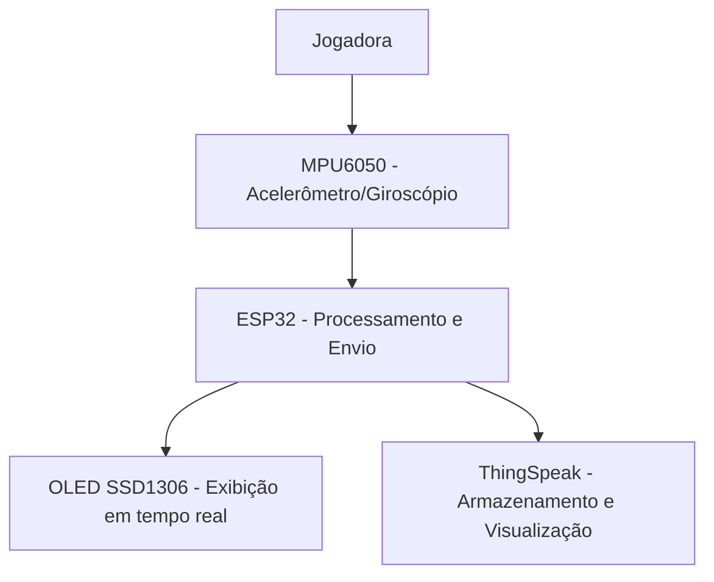

# Projeto: Monitoramento de Jogadoras de Futebol com ESP32
**Objetivo:** Este projeto tem como objetivo monitorar a distância percorrida por jogadoras de futebol em campo e registrar sua movimentação para gerar dados que possam ser usados na criação de mapas de calor e estatísticas. Ele também serve para demonstrar a comunicação entre dispositivos IoT e a plataforma ThingSpeak via HTTP.

## 👥 Integrantes
- Matheus Kitamura Gurther - RM563205
- Victor Oliviera Alves - RM565723  
- Matheus Barroso - RM561308
- João Guilherme Guida - RM565244

## 🏗️ Arquitetura Proposta

### Diagrama

### Explicação
1. O **MPU6050** coleta dados de aceleração.  
2. O **ESP32** calcula a distância percorrida e simula coordenadas no campo.  
3. Os dados são exibidos no **OLED SSD1306**.  
4. O **ESP32** envia as informações periodicamente para o **ThingSpeak**, onde podem ser analisadas e utilizadas para mapas de calor e relatórios.  

---

## ⚙️ Recursos Necessários
- **Hardware**  
  - ESP32  
  - MPU6050 (Acelerômetro e Giroscópio)  
  - SSD1306 OLED (128x64)  
  - Jumpers de conexão  

- **Software**  
  - Arduino IDE (ou Wokwi para simulação)  
  - Bibliotecas:  
    - `Adafruit_SSD1306`  
    - `Adafruit_GFX`  
    - `Adafruit_MPU6050`  
    - `WiFi.h`  
    - `HTTPClient.h`  

- **Serviço Web**  
  - Conta no [ThingSpeak](https://thingspeak.com/)  
  - Chave de API configurada no canal  

---

## 🔗 Link para o Projeto no Wokwi

- [Projeto no Wokwi](https://wokwi.com/projects/446809202770752513)

## 📷 Evidências

- Conexão com o servidor HTTP

- Imagem do OLED

- Imagem do ThingSpeak
